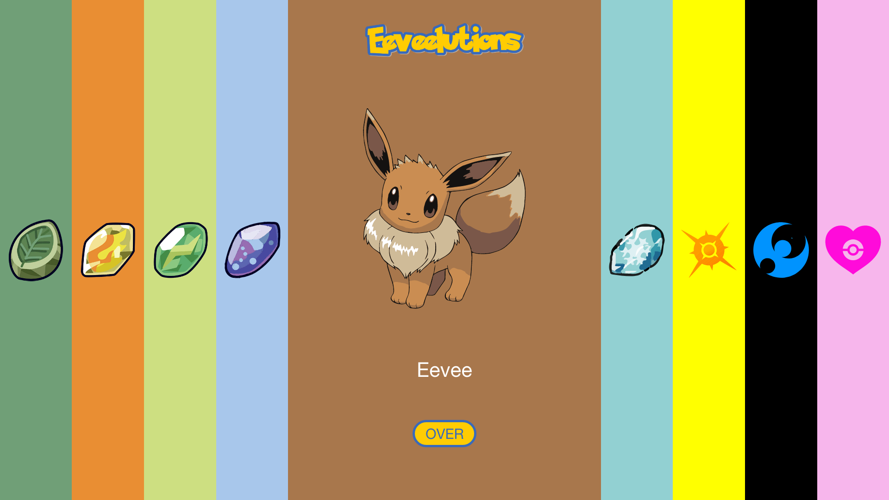
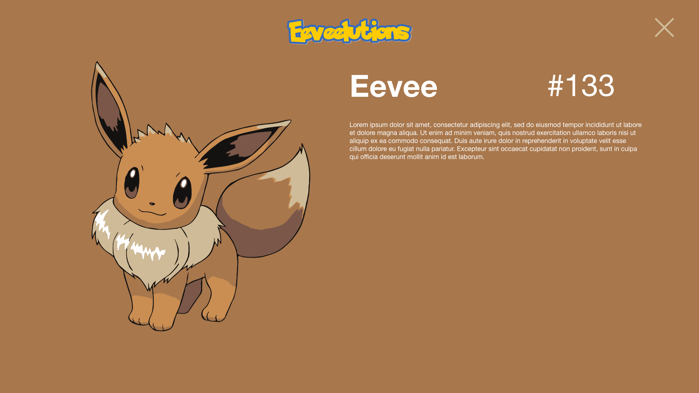
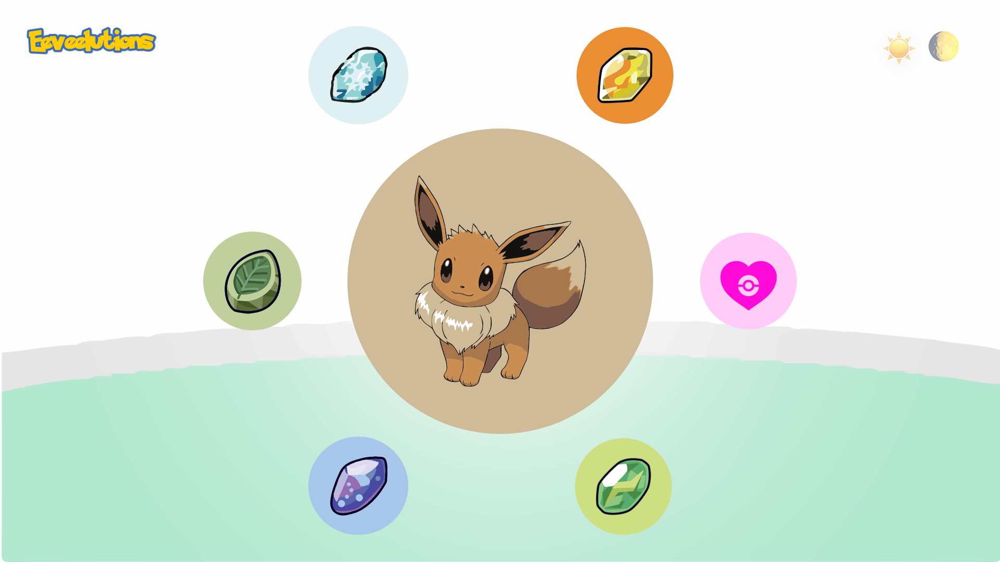
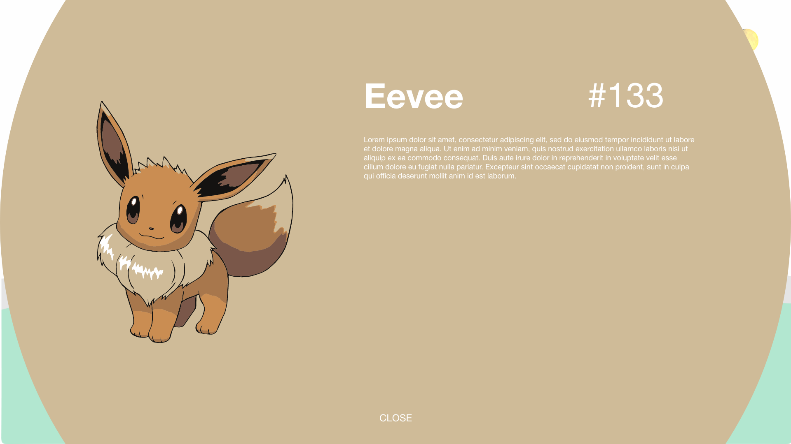
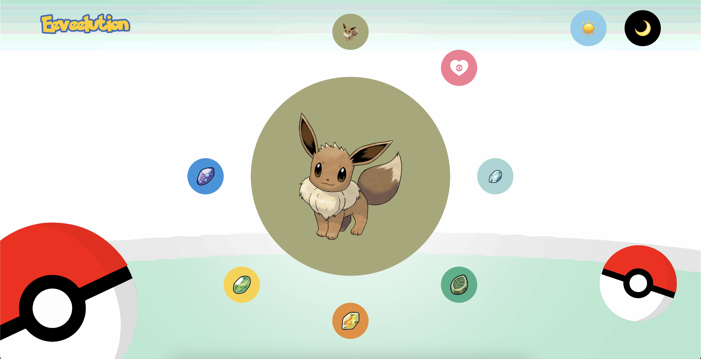
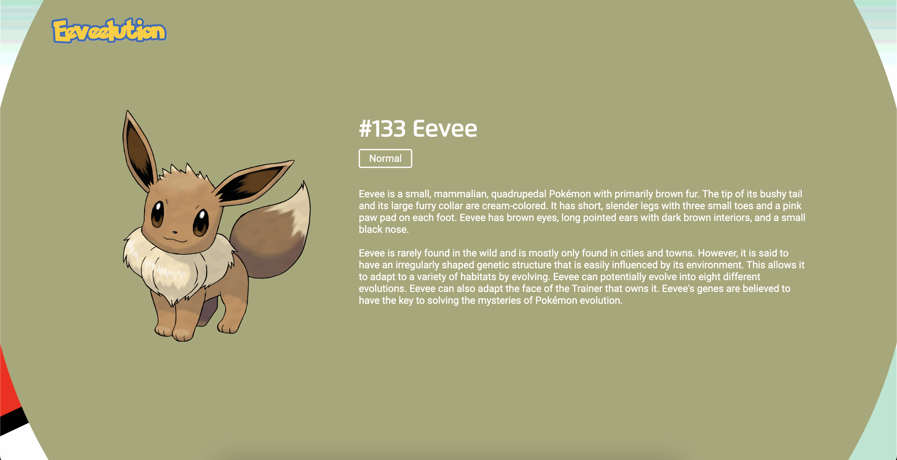
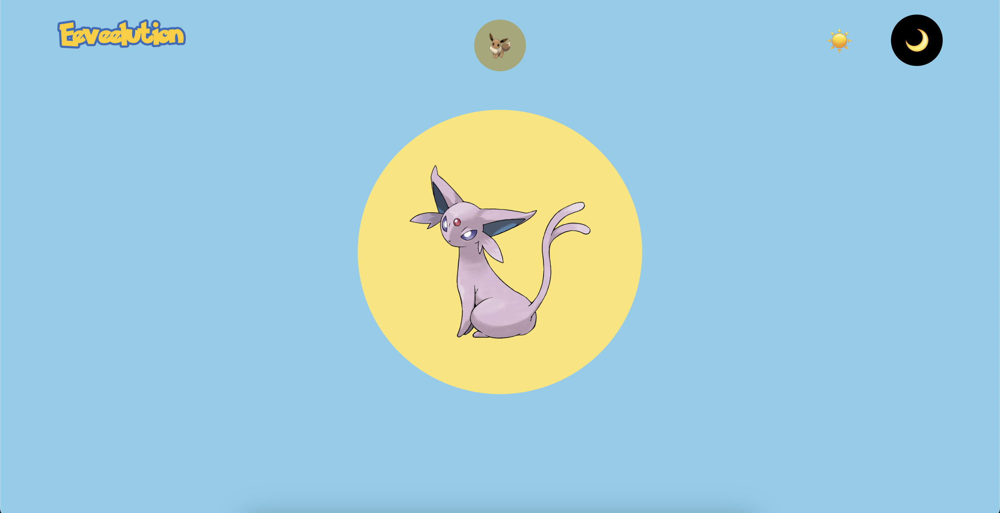
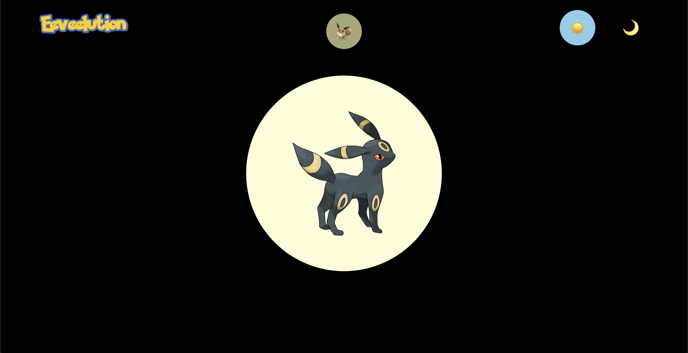
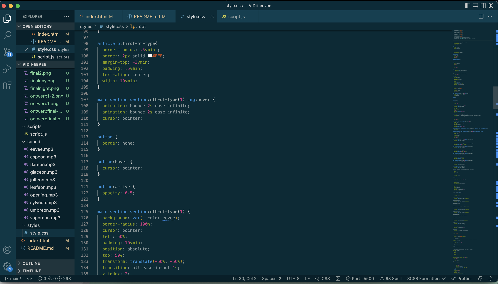

# Procesverslag
Markdown is een simpele manier om HTML te schrijven.  
Markdown cheat cheet: [Hulp bij het schrijven van Markdown](https://github.com/adam-p/markdown-here/wiki/Markdown-Cheatsheet).

Nb. De standaardstructuur en de spartaanse opmaak van de README.md zijn helemaal prima. Het gaat om de inhoud van je procesverslag. Besteedt de tijd voor pracht en praal aan je website.

Nb. Door *open* toe te voegen aan een *details* element kun je deze standaard open zetten. Fijn om dat steeds voor de relevante stuk(ken) te doen.

## Jij

### Ontwerper:
Yousri Bouzaien 

#### Je startniveau:
Rood

# Je plan

  
De eerste versie/schets van je ontwerp & je persoonlijke uitdaging

  ### De eerste versie/schets:
  
  

  ### Mijn uiteindelijke ontwerp
  
  

  ### Je ambitie: 
  Aan deze technieken/punten wil ik werken:
  - Javascript beter begrijpen hoe je erin CSS / en Html elementen kunt aanpassen.
  - Nettere code schrijven.
  - Mijn ontwerp uitwerken tot een goed werkend prototypen/ eind product.
  
 

## Voortgang/Feedback 1

  
Mijn bevindingen + wijzigingen (minimaal 5)

  ### Bevinding 1:
  Mijn ontwerp leek te veel op het voorbeeld

  #### oplossing:
  Ik heb nog een extra dag besteed aan het bedenken van ideeën en schetsen gemaakt.

  ### Bevinding 2:
  Ik begon juist eerst digitaal en daar beperk je jezelf mee in de begin fase van het ontwerp proces

  #### oplossing:
  Beginnen met schetsen

  Omdat ik tijdens mijn eerste feedback nog geen goed ontwerp had heb ik niet veel bevindingen.
 

## Voortgang/Feedback 2

  
Mijn bevindingen + wijzigingen (minimaal 5)

  
  ### Bevinding 1:
  Ik had nog geen tekst toegevoegd in mijn ontwerp.

  #### oplossing:
  Tekst toegevoegd in het ontwerp.

  ### Bevinding 2:
  De afbeeldingen waren niet allemaal van even goeie kwaliteit.

  #### oplossing:
  Afbeeldingen zelf in illustrator geplakt en met image trace beter gemaakt.

  ### Bevinding 3:
  Ik had CSS voornamelijk met classes en/of id's geselecteerd.

  #### oplossing:
  Met de juiste selectoren gewerkt en alleen voor javascript classes en id's gebruikt.

  ### Bevinding 4:
  Ik had nog geen comments toegevoegd in CSS.

  ### oplossing:
  Comments toevoegen waar nodig.

   ### Bevinding 5:
   de volgorde van propperties had ik nog niet over nagedacht.

   ### oplossing:
   Gekozen om het op alfabetische volgorde neer te zetten zodat ik snel het juiste kan vinden.

## Voortgang/Feedback 3

  
Mijn bevindingen + wijzigingen

  
  ### Bevinding 1:
  Ik had met JS css toegevoegd aan de html en dat is niet de bedoeling.

  #### oplossing:
  Gewerkt met classes toevoegen en wijzigen in javascript ipv css toevoegen aan html.

### Bevinding 2:
  Bronnenlijst was nog niet ingevoerd in mijn readme en mijn code.

  #### oplossing:
 Mijn gebruikte bronnen op gezocht en toegevoegd.

### Bevinding 3:
Ik had nog niet gewerkt met custom properties.

#### oplossing:
Gekeken hoe dit werkt en het vervolgens toegepast in mijn CSS.

### Bevinding 4:
Ik had nog geen fonts ingeladen in mijn CSS / html

### oplossing:
Dit ook weer opgezocht en vervolgens toegepast.

### Bevinding 5:
Ik liep achter met mijn readme.

### oplossing:
Alles bijgewerkt en alles was weer up to date.

## Reflectie

  
Mijn eindresultaat & persoonlijke ontwikkeling

  ### Je uitkomst - karakteristiek screenshot(s):
  
  
  
  

  ### Dit ging goed/Heb ik geleerd: 
  Ik heb geleerd te letten op hoe je betere code kan schrijven door gebruik te maken van andere CSS selectoren dan CLASSES en ID's

  

  ### Dit was lastig/Is niet gelukt:
  Ik had graag de animatie van het evolueren van de eevee anders gewild maar doordat ik de eerste week ziek was en ik geen tijd had om het uitgebreider te doen heb ik het niet kunnen doen en is het niet gelukt.

## Bronnenlijst

continu bijhouden terwijl je werkt

Nb. Wees specifiek ('css-tricks' als bron is bijv. niet specifiek genoeg).

1. Encyclopedie over Pokémon (https://bulbapedia.bulbagarden.net)
2. Ik heb codepen gebruikt als ik soms niet eruit kwam met code.
3. For each javascript met hulp van Jeffrey en (https://developer.mozilla.org/en-US/docs/Web/JavaScript/Reference/Global_Objects/Array/forEach)
4. Loops in JS (https://developer.mozilla.org/en-US/docs/Web/JavaScript/Guide/Loops_and_iteration) en ook een project uit het eerste jaar van mezelf in terug gekeken.

